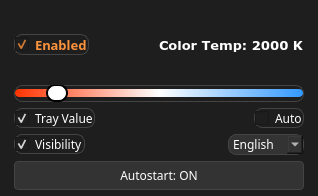

# Gamma Slider X11

### [English]([https://github.com/RanidCast/gamma-slider-x11/blob/main/README.md](https://github.com/RanidCast/gamma-slider-x11/tree/dev?tab=readme-ov-file#)) | [Русский](https://github.com/RanidCast/gamma-slider-x11/blob/main/README_RU.md)

A small tray utility for changing screen color temperature on Linux/X11.

It is a lightweight GUI wrapper around a tiny bundled X11/RandR gamma engine. The app was made for quick personal use from the system tray: click the tray icon, move the slider, and the screen temperature changes immediately.

> X11 only. Wayland does not expose the same RandR gamma controls to regular desktop applications, so this tool is intentionally limited to X11 sessions.

## Screenshot




## Features

- Tray icon with a compact popup slider.
- Color temperature range from 1000K to 10000K.
- Optional value display directly in the tray icon.
- Enable/disable switch.
- Optional higher gamma/contrast mode for better visibility.
- Smooth automatic day/night mode.
- Autostart support.
- PyQt5/PyQt6 compatibility.
- Tiny bundled gamma engine, no full Redshift dependency required.

## Requirements

- Linux with an X11 session.
- Python 3.
- PyQt5 or PyQt6.
- X11 RandR support.

On many desktop distributions PyQt is already available. If not, install the package from your distribution repositories, for example `python-pyqt5`, `python3-pyqt5`, or `python3-pyqt6`.

## Install

```bash
git clone https://github.com/RanidCast/gamma-slider-x11.git
cd gamma-slider-x11
./install.sh --install
```

Check the installation:

```bash
./install.sh --check
```

Run it immediately:

```bash
python3 app.py
```

After installation, Gamma Slider appears in the application menu and is added to autostart.

## Uninstall

```bash
./install.sh --uninstall
```

This removes the menu entry, autostart entry, config, logs, and the unpacked gamma engine from the user profile. It does not remove the cloned project directory.

## Packaging

Prebuilt release files are attached in GitHub Releases:

- `gamma-slider-x11(v1.0).zip` for the plain source bundle
- `gamma-slider-x11_1.0.0_all.deb` for Debian/Ubuntu/Mint
- `gamma-slider-x11-1.0.0-1.noarch.rpm` for Fedora/RPM-based distros
- `gamma-slider-x11-1.0.0-1-x86_64.pkg.tar.zst` for Arch

Install the packages directly:

```bash
sudo apt install ./gamma-slider-x11_1.0.0_all.deb
sudo dnf install ./gamma-slider-x11-1.0.0-1.noarch.rpm
sudo pacman -U ./gamma-slider-x11-1.0.0-1-x86_64.pkg.tar.zst
```

## GNOME Desktop Known Issues

If you are running the GNOME desktop environment, please note that GNOME has native restrictions regarding the system tray:

1. **Missing Tray Icon:** GNOME does not support app indicators natively. You must manually install and enable an extension like **AppIndicator and KStatusNotifierItem Support** to make the tray icon visible.
2. **Click Behavior Bug:** Due to the way GNOME's AppIndicator extension translates mouse events to PyQt applications, single-clicking (both Left and Right click) on the tray icon might immediately trigger the context menu and execute the "Exit/Quit" action. 
   - **Workaround:** Double-click the tray icon to open the program window properly, or use the **Middle Mouse Button (Scroll Click)** to trigger a clean Right-click menu without instantly closing the app.

Additionally, remember that this tool is strictly for X11 sessions. If your distribution defaults to Wayland, you must switch your session to X11/Xorg on the login screen to use Gamma Slider.

## Licensing

This project is intended to be released under the GNU GPL v3.0 or later.

The bundled gamma engine uses X11/RandR gamma ramp logic and blackbody color data adapted from Redshift-style implementations. Because that work is GPL-compatible/GPL-derived, the safest license for this project is GPL-3.0-or-later.

If you redistribute modified versions, keep the same license terms and preserve attribution to the original Redshift project where applicable.

## Notes

The bundled engine is extracted on first launch to:

```text
~/.local/share/gamma-slider/gamma-engine
```

Configuration is stored in:

```text
~/.config/gamma-slider/gamma_slider.conf
```

Logs are stored in:

```text
~/.local/share/gamma-slider/gamma_slider.log
```

The app has been tested on KDE/Plasma, Cinnamon, and Xfce under X11.
