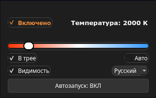

# Gamma Slider X11

### [English](https://github.com/RanidCast/gamma-slider-x11/blob/main/README.md) | Русский

Небольшая утилита в трее для изменения цветовой температуры экрана в Linux/X11.

Это легкая GUI-обвязка вокруг маленького встроенного X11/RandR gamma engine. Приложение сделано для быстрого управления из системного трея: нажал на значок, подвигал слайдер, температура экрана сразу изменилась.

> Только X11. Wayland не дает обычным приложениям такого же доступа к RandR gamma controls, поэтому эта утилита сознательно рассчитана только на X11-сессии.

## Скриншот




## Возможности

- Значок в трее и компактное всплывающее окно со слайдером.
- Диапазон цветовой температуры от 1000K до 10000K.
- Опциональное отображение значения прямо на значке в трее.
- Быстрое включение/выключение эффекта.
- Режим повышенной gamma/контрастности для лучшей видимости.
- Плавный автоматический режим день/ночь.
- Автозапуск.
- Совместимость с PyQt5 и PyQt6.
- Встроенный маленький gamma engine, без зависимости от полного Redshift.

## Требования

- Linux с X11-сессией.
- Python 3.
- PyQt5 или PyQt6.
- Поддержка X11 RandR.

На многих дистрибутивах PyQt уже установлен. Если нет, поставьте пакет из репозиториев вашей системы, например `python-pyqt5`, `python3-pyqt5` или `python3-pyqt6`.

## Установка

```bash
git clone https://github.com/RanidCast/gamma-slider-x11.git
cd gamma-slider-x11
./install.sh --install
```

Проверить установку:

```bash
./install.sh --check
```

Запустить сразу:

```bash
python3 app.py
```

После установки Gamma Slider появится в меню приложений и добавится в автозагрузку.

## Удаление

```bash
./install.sh --uninstall
```

Команда удаляет пункт меню, автозагрузку, конфиг, логи и распакованный gamma engine из профиля пользователя. Папка с исходниками проекта не удаляется.

## Упаковка

Готовые файлы релиза прикрепляются в GitHub Releases:

- `gamma-slider-x11(v1.0).zip` для исходного архива
- `gamma-slider-x11_1.0.0_all.deb` для Debian/Ubuntu/Mint
- `gamma-slider-x11-1.0.0-1.noarch.rpm` для Fedora/RPM-based дистрибутивов
- `gamma-slider-x11-1.0.0-1-x86_64.pkg.tar.zst` для Arch

Пакеты ставятся напрямую:

```bash
sudo apt install ./gamma-slider-x11_1.0.0_all.deb
sudo dnf install ./gamma-slider-x11-1.0.0-1.noarch.rpm
sudo pacman -U ./gamma-slider-x11-1.0.0-1-x86_64.pkg.tar.zst
```

## Известные проблемы в окружении GNOME

Если вы используете графическую оболочку GNOME, пожалуйста, учтите специфику работы её системного трея:

1. **Отсутствие значка:** В чистом GNOME поддержка системного трея полностью вырезана разработчиками. Чтобы значок программы появился на панели, вам необходимо вручную установить и включить расширение **AppIndicator and KStatusNotifierItem Support**.
2. **Глюк с кликами мыши:** Из-за особенностей передачи событий мыши расширением GNOME в приложения на PyQt, одиночный клик (как левой, так и правой кнопкой мыши) по значку может ошибочно активировать контекстное меню и сразу нажать кнопку «Выход».
   - **Как обойти:** Используйте **двойной клик ЛКМ** для корректного открытия окна программы. Чтобы вызвать меню настроек без риска закрыть приложение, нажимайте на значок **колёсиком мыши (средней кнопкой)**.

Учтите, что утилита работает строго в сессии X11. Если ваш дистрибутив по умолчанию запускается на Wayland, вам необходимо вручную переключить сеанс на X11 (Xorg) на экране выбора пользователя при входе в систему.


## Лицензия

Проект предполагается публиковать под GNU GPL v3.0 или более поздней версией.

Встроенный gamma engine использует X11/RandR gamma ramp logic и таблицу blackbody colors, адаптированные из Redshift-подобных реализаций. Так как такая основа GPL-совместима/GPL-производна, самый безопасный вариант лицензии для проекта - GPL-3.0-or-later.

Если вы распространяете измененные версии, сохраняйте те же условия лицензии и указывайте авторство оригинального проекта Redshift там, где это применимо.

## Заметки

Встроенный engine распаковывается при первом запуске сюда:

```text
~/.local/share/gamma-slider/gamma-engine
```

Конфиг хранится здесь:

```text
~/.config/gamma-slider/gamma_slider.conf
```

Логи хранятся здесь:

```text
~/.local/share/gamma-slider/gamma_slider.log
```

Приложение проверялось в KDE/Plasma, Cinnamon и Xfce под X11.
